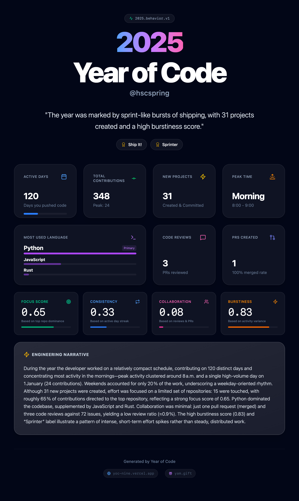

# 2025 Year of Code (代码之年)

Generate your customized GitHub Year-in-Review report. Analyzes your engineering DNA, behaviors, and activity patterns to create a beautiful, shareable profile.

**[Try it Live](https://yoc-nine.vercel.app)** **[在线访问](https://yoc.huggingai.cn)** 

 

## Features ✨

*   **🔒 Privacy First**: Your GitHub Token and data are processed entirely locally in your browser.
*   **📊 Deep Analytics**:
    *   **Activity**: Active Days, Peak Times, Commit Streaks.
    *   **Focus**: Top Languages, Repo dominance.
    *   **Behavior**: Collaboration scores, Consistency, and Burstiness.
*   **🧬 Engineering Persona**: Discover your engineering style (e.g., "Sprinter", "Ship It!").
*   **🌍 Multi-language**: Supports English and Chinese.
*   **🖼️ Shareable Export**: Download high-quality images of your report.

## Getting Started 🚀

### Prerequisites

*   Node.js (v18+)
*   A GitHub Personal Access Token (Classic) with `repo`, `read:user`, and `read:org` scopes.

### Installation

1.  Clone the repository:
    ```bash
    git clone https://github.com/hscspring/yoc.git
    cd yoc
    ```

2.  Navigate to the web directory and install dependencies:
    ```bash
    cd web
    npm install
    ```

3.  Run the development server:
    ```bash
    npm run dev
    ```

4.  Open [http://localhost:5173](http://localhost:5173) in your browser.

## Deployment

This project is built with Vite and can be easily deployed to Vercel, Netlify, or GitHub Pages.

```bash
cd web
npm run build
```

## Tech Stack

*   React
*   Vite
*   Tailwind CSS
*   GitHub GraphQL API
*   LangChain / LLM Integration (Optional for narrative generation)

## License

MIT
